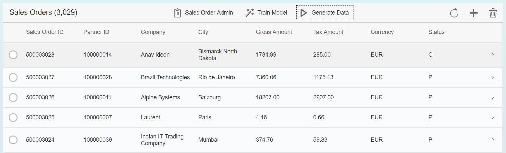
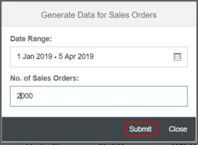
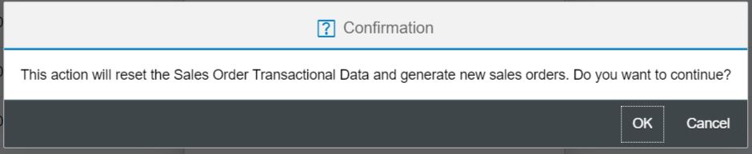
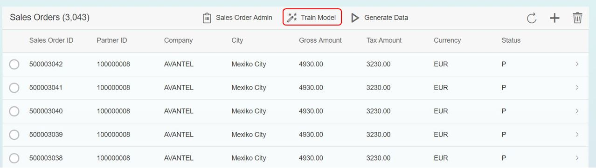
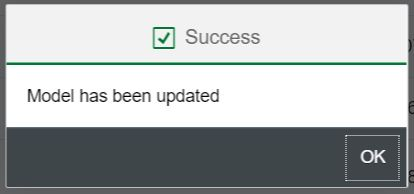
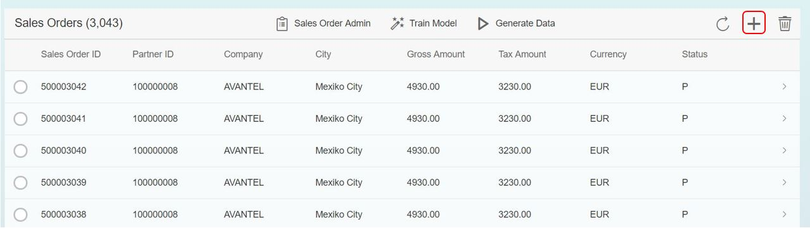
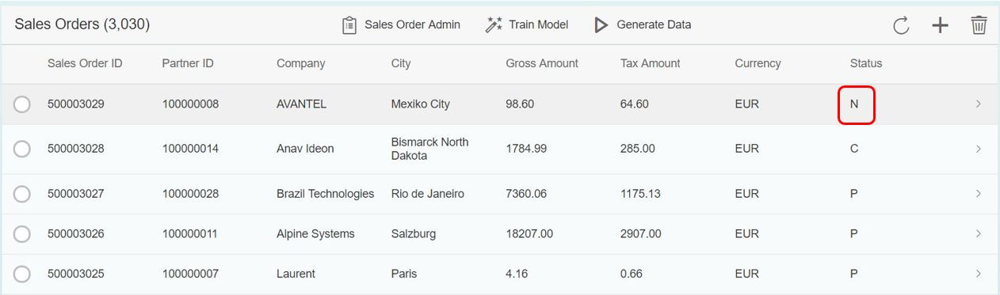
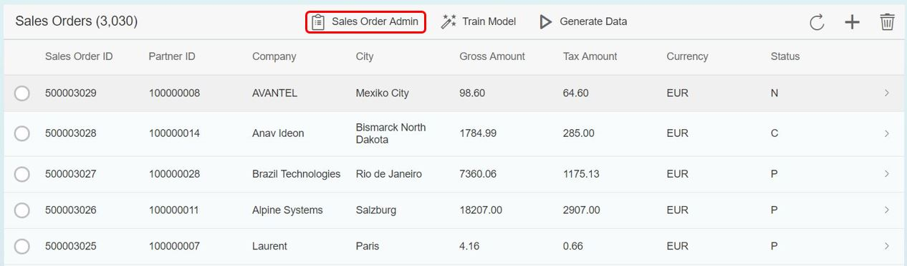
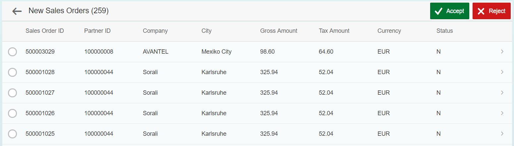

# SHINE-ML

SHINE-ML is a demo application which makes it easy to learn how to build application using HANA PAL (Predictive Analysis Library). This application is developed as an extension on top of SHINE for SAP HANA XS Advanced  application.

### Prerequisite

- Install the `Application Function Library (AFL)`, which includes the PAL.
  - For information on how to install or update AFL, see "Installing or Updating SAP HANA Components" in [SAP HANA Server Installation and Update Guide](https://help.sap.com/viewer/2c1988d620e04368aa4103bf26f17727/2.0.03/en-US/7eb0167eb35e4e2885415205b8383584.html)
  - To confirm that the PAL functions were installed successfully, you can check the following three public views:
      - sys.afl_areas
      - sys.afl_packages
      - sys.afl_function
  
    These views are granted to the PUBLIC role and can be accessed by anyone.

    To check the views, run the following SQL statements either in webide Sql console or in HANA Studio:
    
    ```
    SELECT * FROM "SYS"."AFL_AREAS" WHERE AREA_NAME = 'AFLPAL';
    SELECT * FROM "SYS"."AFL_PACKAGES" WHERE AREA_NAME = 'AFLPAL';
    SELECT * FROM "SYS"."AFL_FUNCTIONS" WHERE AREA_NAME = 'AFLPAL'; 
    ```
    
    The result will tell you whether the PAL functions were successfully installed on your system.
    
- Enable the `Script Server` in HANA instance.
    - If the Script server is not enabled, run the below command as a system user to enable it.
    
      ```
      ALTER DATABASE <Tenant Database> ADD 'scriptserver';
      ```
    - To check the script server , run the below command against tenant database.
      ```
      SELECT * FROM SYS.M_SERVICES;
      ```

- `SHINE` application must be installed. 
  - If SHINE is not install please install it. Steps to install SHINE can be found [here](https://github.com/SAP/hana-shine-xsa).
   > Important: <b>*Please use this [**shine.mtaext**](documents/shine.mtaext) file for installation of SHINE.`*</b>
   
## Download and Installation

The below steps describes you to run SHINE-ML using 2 approaches. Choose the one that best fits .

1. [Running in SAP Web IDE for SAP HANA](#running-in-sap-web-ide-for-sap-hana)
2. [Generating MTAR using WebIDE and deploy manually to XSA system](#generating-mtar-using-webide-and-deploy-manually-to-xsa-system)

> Important: <b>*Please install SHINE-ML in the same space where SHINE is installed.`*</b>

### Running in SAP Web IDE for SAP HANA

1.  Launch SAP Web IDE for SAP HANA. By default, in SAP HANA, express edition, SAP Web IDE for SAP HANA can be accessed using https://hxehost:53075/
2.  Right click on the `Workspace` folder in WebIDE and choose `Git` -> `Clone Repository`
3.  Enter the URL of the repository as https://github.com/SAP/hana-shine-xsa.git
4.  Click `Clone` Button. Clone should completed successfully. `Ignore` any error like `Unable to run module` for the web module.
5.  Right click on the project hana-shine-xsa and navigate to Git -> Create Local Branch.
6.  In Create a New Local Branch wizard, choose origin/ml from the Source Branch dropdown and click Ok
7.  Right click on project and navigate to `Project`  ->  `Project Settings`
8.  Under Project Settings window navigate to `Space` and choose a desired space from the dropdown. Then click `Install Builder` if not installed
9.  Click `Save` and then `Close`
`Please note SHINE for XS Advanced MTA should be installed before you perfrom the below steps as mentioned in the pre requisite steps above`
10.  Under project `shine-ml` right click on `db` module navigate to `Build` ->  `Build` to build the module. The build should be successful. 
11. Right click on `xsjs` module navigate to `Run` ->  `Run as Node.js Application` to run the service
12. Right click on `web` module navigate to `Run` ->  `Run as Web Application` to run web module
13. Login to SHINE web application using any user e.g. XSA_ADMIN user can be used to login with his credentials.

### Generating MTAR using WebIDE and deploy manually to XSA system
#### Generate MTAR using SAP Web IDE for SAP HANA
1.  Launch SAP Web IDE for SAP HANA
2.  Navigate to `File`  ->  `Git` ->  `Clone Repository`
3.  Enter the URL of the repository as https://github.com/SAP/hana-shine-xsa.git
4.  Click `Clone` Button. Clone should completed successfully. `Ignore` any error like `Unable to run module` for the web module.
5.  Right click on the project hana-shine-apm and navigate to Git -> Create Local Branch.
6.  In Create a New Local Branch wizard, choose origin/ml from the Source Branch dropdown and click Ok
5.  Right click on project and navigate to `Project`  ->  `Project Settings`
6.  Under Project Settings window navigate to `Space` and choose a desired space from the dropdown. Then click `Install Builder` if not installed
7.  Click `Save` and then `Close`
8.  Right click on the project `shine-ml` and navigate to `Build` ->  `Build`
9.  After build get completed successfully, under Workspace navigate to folder `mta_archives` ->  `shine-ml`  and right click on `xsac_shine_ml_1.0.0.mtar` then click on `Export`.
10. After `xsac_shine_ml_1.0.0.mtar` get successfully exported to your local system, copy/move the file to desired XSA system

#### Deploy the MTAR
To deploy the mtar, login to the XSA system via CLI and deploy the mtar file using the following command:

  `xs deploy xsac_shine_ml_1.0.0.mtar`


### Business scenario
Sales Orders generally created in SHINE application are automatically set to status `In Process`. There are possibilities that some Sales Orders gets eventually canceled by a Customer or rejected by a Sales Manager of Itelo company(dummy company showcased in SHINE). This could be due to many reasons like Sales Order created for fraudulent purpose, bad payment history of the customer creating sales order etc. In this scenario, we want to predict if a new sales order can get eventually canceled. Those Sales Orders which the system flags as having a high chance of getting eventually canceled will get manually vetted before its being further processed. All orders are automatically moved to `In process` status except the one's which needs to undergo a manual vetting. The Sales Orders which needs to be vetted will remain in `New` status and Sales Manager can manually vet it.

Here we have used `linear regression` algorithm for binary classification. The algorithm will predict the status of the sales order based on the previous salesorder by customer. If algorithm predict salesorder as a valid salesorder, sales order will be created with 'In Process' status otherwise with 'New' status which can be vetted by sales manager manually.

Please follow below steps to perform the prediction.

**step 1: Generate training data**

To generate the training data click on **"Generate data"** button. It will generate the random sales order. Along with the random salesorder, few records will be generated with some pattern in it, which will be used to train model for status prediction.



Provide number of records needs to be generated.



confirmation pop-up will come up. select OK.



**Step2: Train model**

For generating the training model, click on **Train model**.  Here we have used the `Logistic Regression` algorithm of Hana PAL. Once the `Train model` button is clicked, it will call the `train` procedure which will internally call the `LOGISTICREGRESSION` procedure of HANA PAL. For training the model we are considering the previous sales order of the customers and providing it as a input to the procedure.





**Step 3: Predict status for new sales order**

Click on **"+"** sign to create a new sales order. Once you generate a new sales order, the status of the sales order will be predicted based on the model generated in the above step. The procedure which we have used here is `predict` procedure which will internally call `FORECASTWITHLOGISTICR` procedure of hana PAL.





**Step 4: Sales order approval**

The sales manager can decide whether to move the sales order in the `In Process` status or cancel it.  all the sales order with `New` status will be available in the admin screen and sales manager can manually vet all these sales orders. User should have `SHINE_ADMIN` role in order to access this screen.




