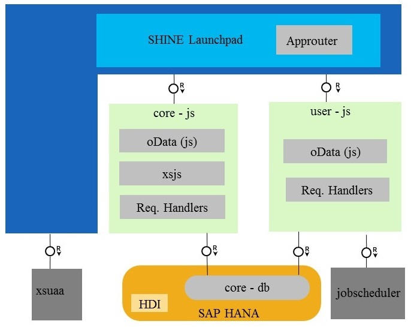

SAP TechEd 2017 CPL165 (and CPL611) Exercises
===============
With SAP HANA 1 SPS 11, SAP has introduced a major new application server architecture: SAP HANA extended application services, advanced model, on premise. This architecture is based on Cloud Foundry, which is now also available in SAP Cloud Platform. Join this session to develop an application using SAP HANA, Cloud Foundry, and SAP Web IDE. Get to know SAP HANA native development concepts and how to apply them in a cloud context.

## Scenario Overview
The application that is used for this session is [SHINE (SAP HANA Interactive Education)](https://github.com/SAP/hana-shine-xsa). SHINE is a demo application that makes it easy to learn how to build applications on SAP HANA extended application services advanced model. This demo application is delivered as a package that contains sample data and design-time developer objects for the applications database tables, views, OData and user interface. SHINE is a Multi-Target Application (MTA) and follows the XS Advanced Programming Model.

It consists of the following packages:
- core-db - This package contains core data model artifacts required to create the tables and other database artifacts (e.g. .hdbcds, .hdbsequence, ...).

- core-js - This package contains the Node.js implementation of Data Generator, Purchase Order Worklist, and Sales Dashboard (backend).

- user-js - This package contains the User CRUD applications implementation in Node.js using XSOData libraries and it also showcases how to use the the job scheduler service in Cloud Foundry for creating and scheduling jobs.

- web - This package contains the user interface for the SHINE Launchpad, Data Generator, Purchase Order Worklist, Sales Dashboard, and User CRUD applications implemented in SAPUI5.

Architecture:

##	What You Will Learn
In this hands-on session, you will learn
- to build microservices based SAP HANA XS Advanced Multi Target Application using SAP Web IDE
- to deploy the Multi Target Application to Cloud Foundry Environment  
- to create HANA business logic using SQL functions
- to create business logic using Node.js
- to build a user interface backed by an REST services

## Exercises
This hands-on session consists of following exercises

#### Exercise 1: Getting an SAP Cloud Platform developer account and cloning SHINE code from GitHub
In this exercise, you will sign up for a free SAP Cloud Platform Cloud Foundry account which you can use to deploy and run the SHINE applications shown in Figure 1 above.  You will also clone the Git repository that contains the complete sample project from GitHub into your local environment. Follow this [link](https://github.com/SAP/hana-shine-xsa/tree/shine-cf/exercises/exercise01/README.md "Optional title") to get to the step-by-step description of this exercise.

#### Exercise 2: Understand SHINE modules and build the application
In this exercise, you will explore the SHINE application which is a Multi Target Application(MTA), understand the different modules and the Multi Target Application Development Descriptor (mta.yaml) and then build the SHINE application and generate MTA archive(mtar). Follow this [link](https://github.com/SAP/hana-shine-xsa/tree/shine-cf/exercises/exercise02/README.md "Optional title") to get to the step-by-step description of this exercise.

#### Exercise 3: Deploy application to SAP Cloud Platform Cloud Foundry Environment
In this exercise, you will deploy the MTA archive (mtar) to SAP Cloud Platform Cloud Foundry Environment using the Cloud Foundry Command Line Interface(CLI). Follow this [link](https://github.com/SAP/hana-shine-xsa/tree/shine-cf/exercises/exercise03/README.md "Optional title") to get to the step-by-step description of this exercise.

#### Exercise 4: Implement a Table User Defined Function for fuzzy search
In this exercise, you will add a HANA database artifact for performing Fuzzy search. Follow this [link](https://github.com/SAP/hana-shine-xsa/tree/shine-cf/exercises/exercise04/README.md "Optional title") to get to the step-by-step description of this exercise.  

#### Exercise 5: Expose REST API for Fuzzy Search
In this exercise, you will expose fuzzy search functionality implemented in exercise 4 as REST API. Follow this [link](https://github.com/SAP/hana-shine-xsa/tree/shine-cf/exercises/exercise05/README.md "Optional title") to get to the step-by-step description of this exercise.

#### Exercise 6: Develop User Interface
In this exercise, you will develop a SAPUI5 based User Interface and bind it to REST API implemented in exercise 6 for firing the search. Follow this [link](https://github.com/SAP/hana-shine-xsa/tree/shine-cf/exercises/exercise06/README.md "Optional title") to get to the step-by-step description of this exercise.

#### Exercise 7: Build updated SHINE application and deploy it
In this exercise, you will build the SHINE application extended with Text Analysis feature and deploy it to SAP Cloud Platform Cloud Foundry Environment. Follow this [link](https://github.com/SAP/hana-shine-xsa/tree/shine-cf/exercises/exercise07/README.md "Optional title") to get to the step-by-step description of this exercise.

## Summary
In this hands-on session, you have learned how to, develop and deploy microservice based Multi Target Application on Cloud Foundry Environment, implement business logic in SQL and Node.js and finally consume it in SAPUI5 based user interface.
