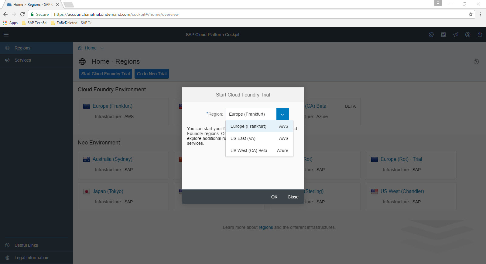
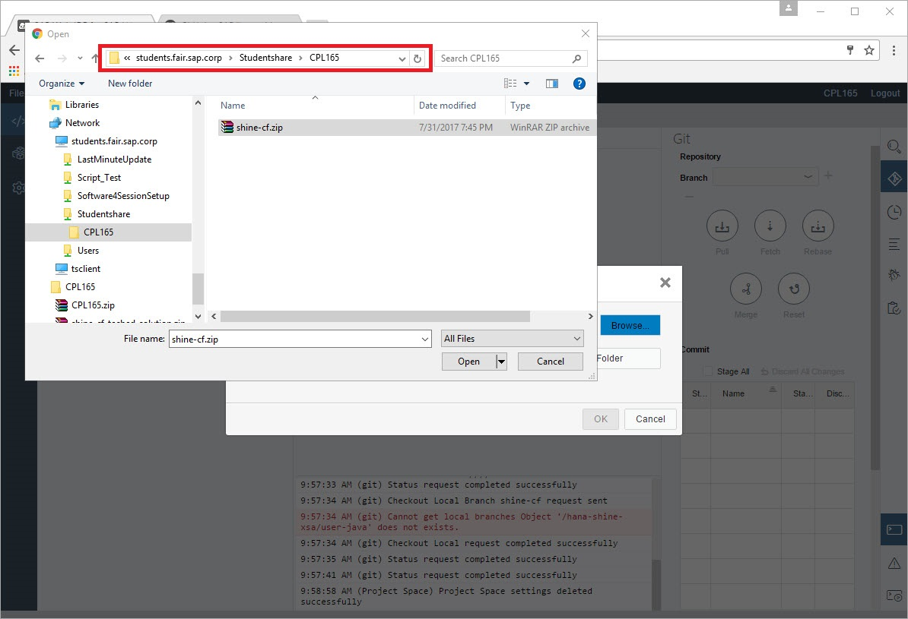
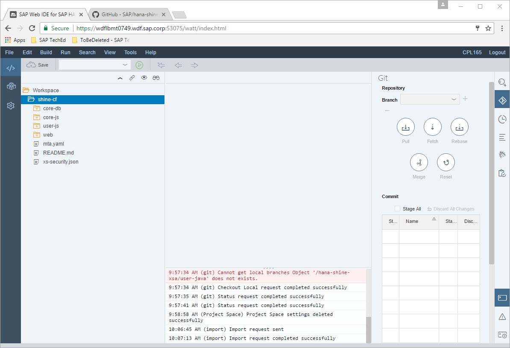

Exercise 01: Getting an SAP Cloud Platform developer account and cloning SHINE code from Github
===============
## Estimated time

10 mins

## Objective
In this chapter you will create an account in SAP Cloud Platform and obtain an instance of Cloud Foundry environment

## Exercise Description
### 1. Sign up for a trial account of the Cloud Foundry environment (optional, only if you do not yet have a trial account)
1. If you do not yet have a trial or enterprise account of the Cloud Foundry environment, sign up for such an account by following the documentation ["Get a Trial Space on the Cloud Foundry Instance"](https://help.sap.com/viewer/65de2977205c403bbc107264b8eccf4b/Cloud/en-US/76e79d62fa0149d5aa7b0698c9a33687.html).
When you are prompted to select a region select 'Europe(Frankfurt) AWS' or 'US East(VA) AWS'. 
*Do not select US West(CA) Beta Azure or US Central(IA) GCP as jobscheduler service required by SHINE application is not yet available in those regions.*

2. Once you created a trial account of the Cloud Foundry environment navigate to the subaccount 'trial'. 
3. Click on Spaces in the left navigation pane.
4. Click on space 'dev'. 
5. Once applications are deployed they will be visible here.

### 2. Log on to your trail account of the Cloud Foundry environment
1. Log on to the SAP Cloud Platform cockpit using any cockpit URL, such as [https://account.hanatrial.ondemand.com](https://account.hanatrial.ondemand.com).
2. Navigate to the region where your trial account of the Cloud Foundry environment is, it should be either 'Europe(Frankfurt) AWS' or 'US East(VA) AWS'
3. Navigate to the subaccount 'trial'. 
4. Click on Spaces in the left navigation pane.
5. Click on space 'dev'. 
6. Once applications are deployed they will be visible here.

### 3. Clone SHINE code from GitHub
1.  Launch SAP Web IDE by launching URL [https://wdflbmt0749.wdf.sap.corp:53075/]( https://wdflbmt0749.wdf.sap.corp:53075/) in Google Chrome.
2. Login with User: `CPL165` and Password: `Sap12345`.

3. Launch the URL [https://github.com/SAP/hana-shine-xsa](https://github.com/SAP/hana-shine-xsa) in a new window. This is the GitHub Repository where you can find the code for the SHINE application.
4. Click on `Clone or download` button.

5. Click on Copy Clip board icon.
6. Switch to SAP Web IDE.
7. Navigate to File -> Git - Clone Repository.
8. In Clone Git Repository popup paste the GitHub url which was copied in step 5.
9. Click on Clone button.

10. If any error occurs during cloning skip steps below, go to Chapter 3, and follow the steps to import code from zip file.
11. Click on Git Pane. 

12. The master branch of this repository is checkout by default. TechEd exercise code is located in the branch shine-cf-teched. 
13. Click on + button. 
14. A popup open  with title Create New Local branch opens.
15. Select Source Branch as `origin/shine-cf-teched`.  

16. Click on Ok.
17. A pop up with title `Checkout Failed` appears.
18. Click on button `Reset and Checkout`.  

19. In the `Confirmation Needed ` popup click Ok button.
20. The checkout branch changes to shine-cf

### 4. Import SHINE Code from zip (optional, only if you were not able to clone SHINE code from GitHub)
This step is optional and required only if Chapter 2 (Clone SHINE code from Github) fails.
1. In SAP Web IDE navigate to File ->Import -> From File System.
2. In the import popup click on Browse button.
3. Set the folder path as \\students.fair.sap.corp\Studentshare\CPL165 .
4. Select file shine-cf.zip.

5. Click on Open button.
6. Click on Ok button in the Import popup.
7. The shine-cf zip file gets imported.

## Summary
In this exercise you have signed up for SAP Cloud Platform account, to access to Cloud Foundry environment and downloaded/cloned the SHINE code.
 
Continue with [Exercise2](../exercise02/README.md)
