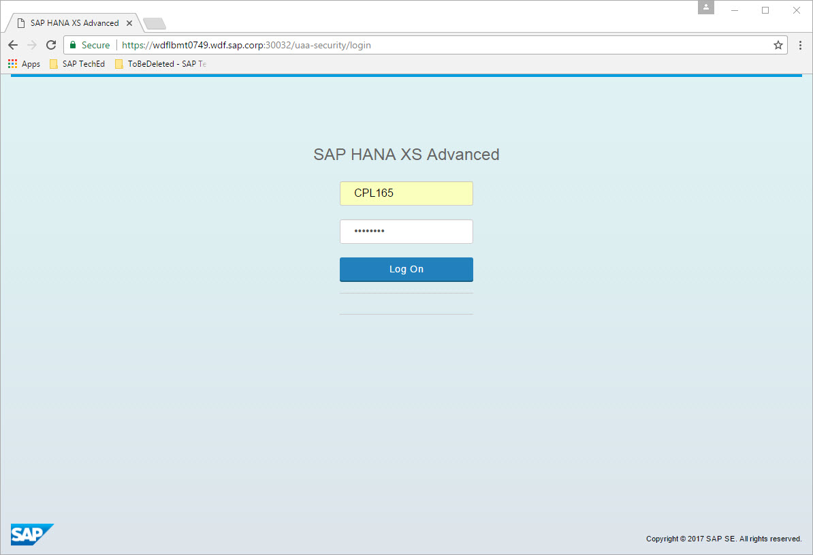
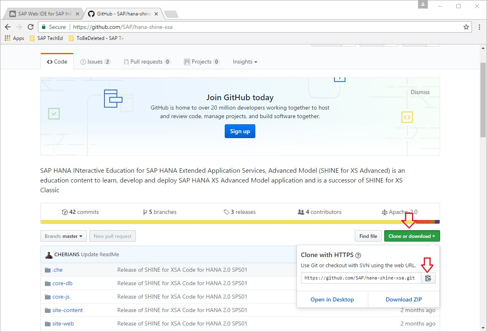
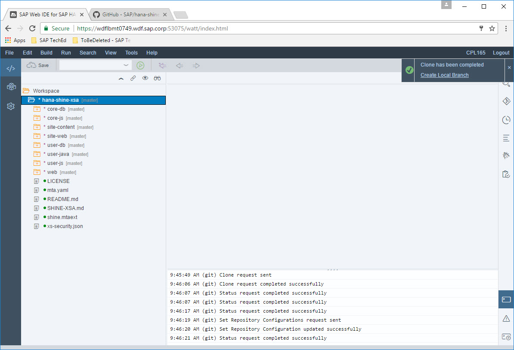
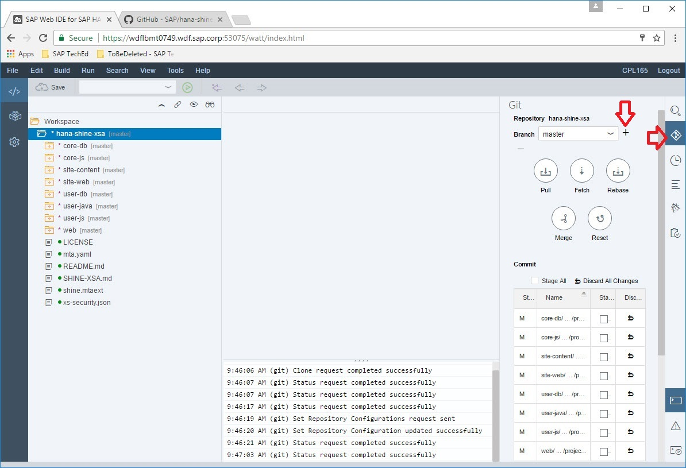
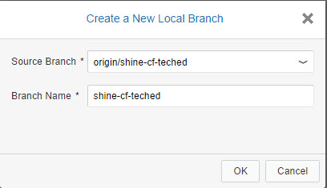
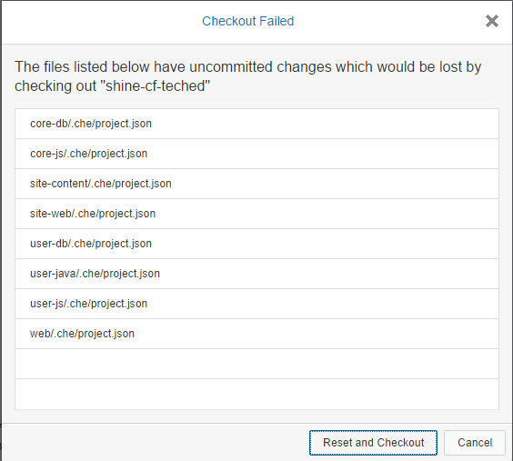
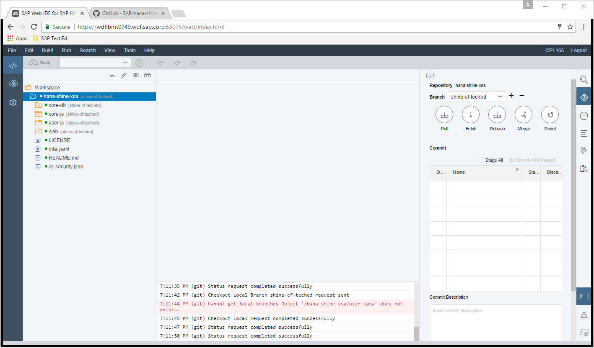

Exercise 01: Getting an SAP Cloud Platform developer account and cloning SHINE code from Github
===============
## Estimated time

10 mins

## Objective
In this chapter you will create an account in SAP Cloud Platform and obtain an instance of Cloud Foundry environment

## Exercise Description
### 1. Log on to your trial account of the Cloud Foundry environment
1. Log on to the SAP Cloud Platform cockpit of your trail account using the cockpit URL [https://account.hanatrial.ondemand.com](https://account.hanatrial.ondemand.com), if you do not yet have an account please register for one (it's free) or contact us and we will give you the login credentials for one.
2. Click on 'Start Cloud Foundry Trial' and choose 'US East (VA)', this creates your Cloud Foundry trial account.
3. Navigate to your subaccount 'trial'. 
4. Click on 'Spaces' in the left navigation pane.
5. Navigate to the your space 'dev'. 
6. Once applications are deployed they will be visible there.

### 2. Clone SHINE code from GitHub
1.  Launch SAP Web IDE for SAP HANA by launching the URL [https://wdflbmt0749.wdf.sap.corp:53075/](https://wdflbmt0749.wdf.sap.corp:53075/) in Google Chrome.
2. Login with the User: `CPL165` and Password: `Sap12345`.

3. Launch the URL [https://github.com/SAP/hana-shine-xsa](https://github.com/SAP/hana-shine-xsa) in a new window. This is the GitHub Repository where you can find the code for the SHINE application.
4. Click on `Clone or download` button.

5. Click on Copy Clip board icon.
6. Switch to SAP Web IDE.
7. Navigate to File -> Git - Clone Repository.
8. In Clone Git Repository popup paste the GitHub url which was copied in step 5.
9. Click on Clone button.

10. If any error occurs during cloning skip steps below, go to Chapter 3, and follow the steps to import code from zip file.
11. Click on Git Pane. 

12. The master branch of this repository is checkout by default. TechEd exercise code is located in the branch shine-cf-teched. 
13. Click on + button. 
14. A popup open  with title Create New Local branch opens.
15. Select Source Branch as `origin/shine-cf-teched`.  

16. Click on Ok.
17. A pop up with title `Checkout Failed` appears.
18. Click on button `Reset and Checkout`.  

19. In the `Confirmation Needed ` popup click Ok button.
20. The checkout branch changes to shine-cf

## Summary
In this exercise you have logged-in into a SAP Cloud Platform account in Cloud Cockpit and cloned the SHINE code from GIT.
 
Continue with [Exercise2](../exercise02/README.md)
