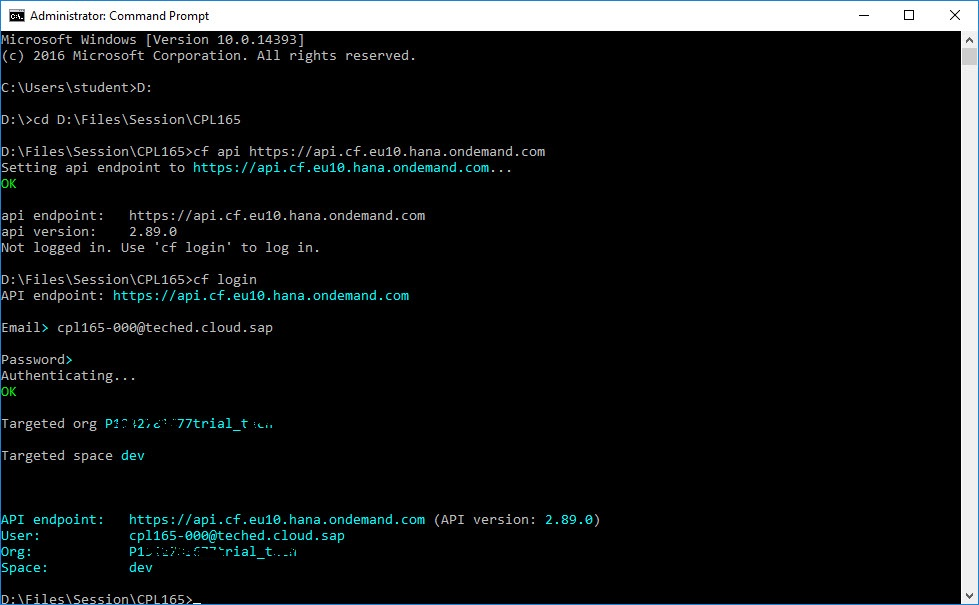
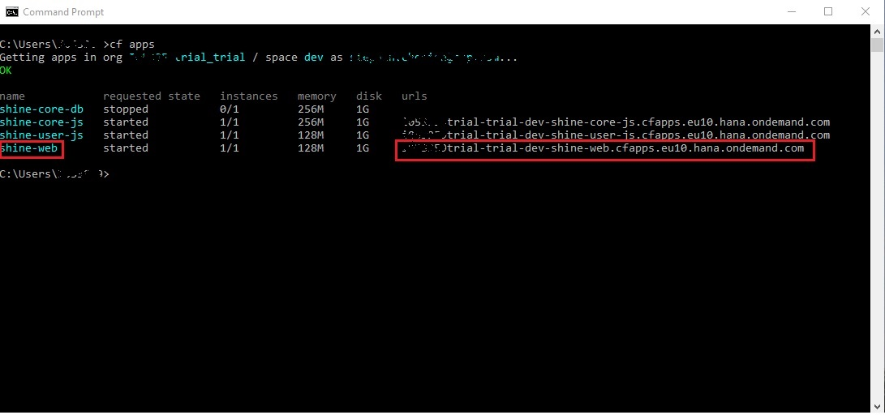
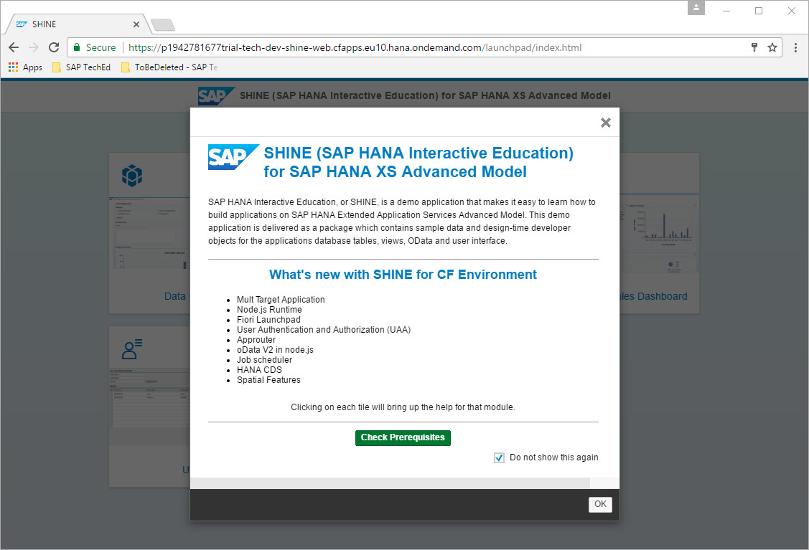
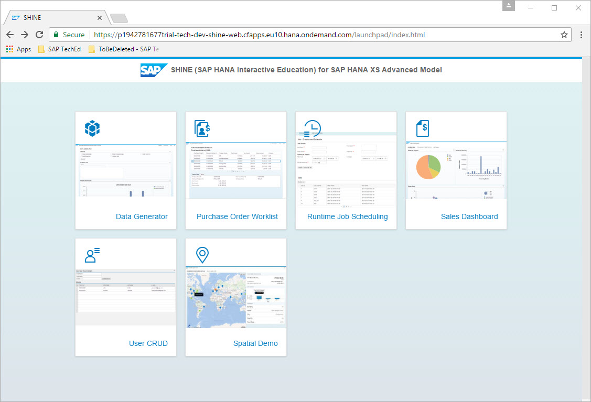
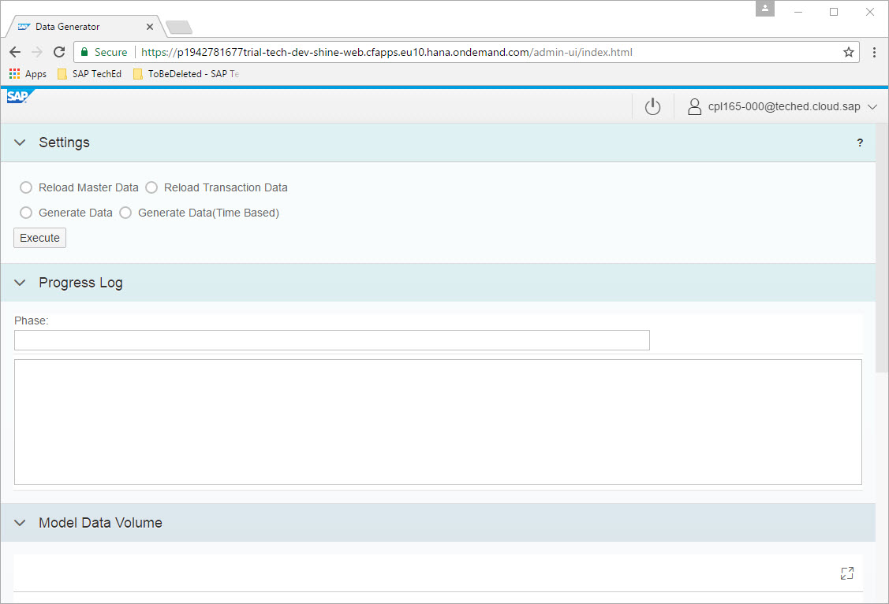
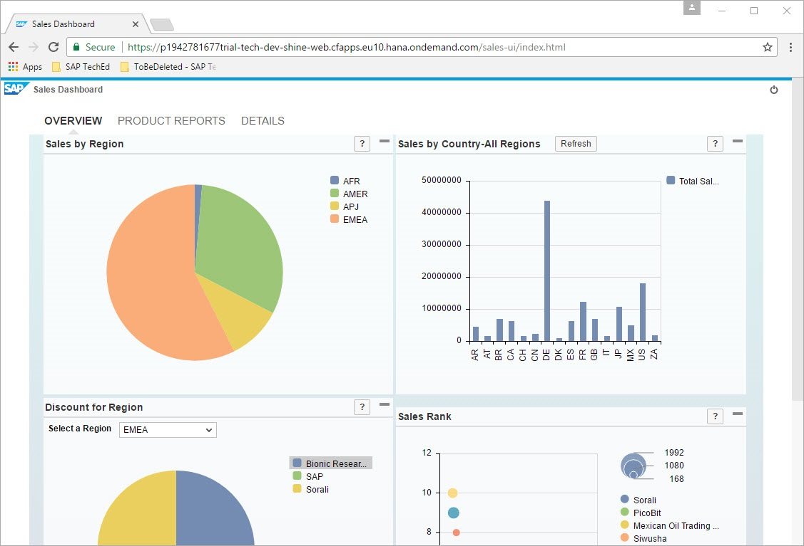

Exercise 03 : Deploy application to SAP Cloud Platform Cloud Foundry Environment
===============
## Estimated time

15 min

## Objective
In Chapter you will deploy the SHINE mtar to Cloud Foundry environment

## Exercise Description
### 1. Deploy SHINE application
1. Open Command Line Interface.
2. Navigate to the folder where you have copied SHINE mtar, if its desktop then `C:\Users\student\Desktop`.
3. Set Cloud Foundry API via CLI by running below command
* if you have chosen Region for your Cloud Foundry instance as Europe (Frankfurt) AWS
 run command ` cf api https://api.cf.eu10.hana.ondemand.com` 
* if you have chosen Region for your Cloud Foundry instance as US East (VA) AWS
 run command ` cf api https://api.cf.us10.hana.ondemand.com` 
4. If you face any connectivity error set proxy by running command
` set http_proxy=proxy:8080`
5. Login to Cloud Foundry by running below command.
` cf login`
6. On being prompted for Email enter email which was used for registering for SAP Cloud Platform Trial account and enter the password.
7. You will be logged into your Cloud Foundry org P*******trial_trial and space dev.  

8. Run the command `cf deploy com.sap.refapps.shine_1.3.10.mtar`
9. The deployment starts.
10. Follow the deploy process and you can notice that first the backing services like uaa, hana etc getting created. 
11. Followed by the service creation one by one the modules starts getting deployed starting with the db module (shine-core-db) and ending with web module (shine-web) 
12. Within a few minutes the complete application get deployed.
13. After deployment run the command `cf apps` to see all the deployed apps.
14. Run command `cf apps` to see all the application instances.
15. Copy the url for the app `shine-web` and paste it in browser.  

16. In a browser login to this url with the SAP Cloud Platform User ID and password.

### 2. Explore SHINE application
1.  Click on Ok to close the Welcome popup.  

2. SHINE Launchpad will be visible.

3. Click on the Data Generator Tile and explore the features.  

4. Click on the Sales Dashboard tile and explore the tabs here.  

## Summary
In this exercise you have deployed SHINE mtar to Cloud Foundry Environment and explored it.
