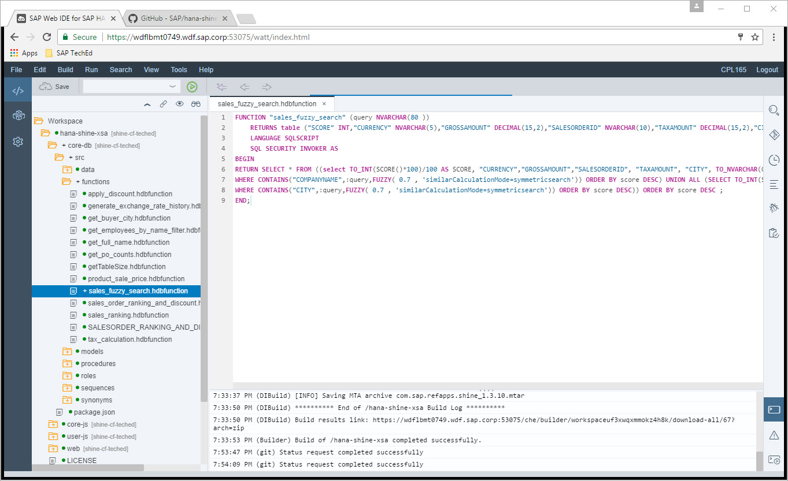

Exercise 04 : Implement a Table User Defined Function for fuzzy search
===============
## Estimated time

5 mins

## Objective
In Chapter you will implement a Table User Defined function

## Exercise Description
1. In Web IDE click on core-db module and expand it.  


2. Navigate to src -> functions.
3. Right click on functions and click on New -> Function.
4. In the New Function popup provide the name of Table User Defined function as `sales_fuzzy_search.hdbfunction`
5. Copy the below code to the sales_fuzzy_search.hdbfunction.

```sql

FUNCTION "sales_fuzzy_search" (query NVARCHAR(80 ))
	RETURNS table ("SCORE" INT,"CURRENCY" NVARCHAR(5),"GROSSAMOUNT" DECIMAL(15,2),"SALESORDERID" NVARCHAR(10),"TAXAMOUNT" DECIMAL(15,2),"CITY" VARCHAR(40),"COMPANYNAME" NVARCHAR(80),"PARTNERID" NVARCHAR(10)) 
	LANGUAGE SQLSCRIPT 
	SQL SECURITY INVOKER AS 
BEGIN 
RETURN SELECT * FROM ((select TO_INT(SCORE()*100)/100 AS SCORE, "CURRENCY","GROSSAMOUNT","SALESORDERID", "TAXAMOUNT", "CITY", TO_NVARCHAR(COMPANYNAME) AS COMPANYNAME, "PARTNERID" FROM "sap.hana.democontent.epm.models::SALES_ORDER_HEADER_W_BUYER"
WHERE CONTAINS("COMPANYNAME",:query,FUZZY( 0.7 , 'similarCalculationMode=symmetricsearch')) ORDER BY score DESC) UNION ALL (SELECT TO_INT(SCORE()*100)/100 AS SCORE, "CURRENCY","GROSSAMOUNT","SALESORDERID", "TAXAMOUNT", TO_NVARCHAR(CITY) AS CITY, "COMPANYNAME" AS COMPANYNAME, "PARTNERID" FROM "sap.hana.democontent.epm.models::SALES_ORDER_HEADER_W_BUYER"
WHERE CONTAINS("CITY",:query,FUZZY( 0.7 , 'similarCalculationMode=symmetricsearch')) ORDER BY score DESC)) ORDER BY score DESC ;
END;

```
or copy code from file [sales_fuzzy_search.hdbfunction](./code/sales_fuzzy_search.hdbfunction)


> The above code implements fuzzy search on SAP HANA Calculation View "sap.hana.democontent.epm.models::SALES_ORDER_HEADER_W_BUYER" which is based on Sales Order Header and Business Partner Table

6. Save the file. 

## Sumary
In this exercise you have created a Table User Defined function in the db module for implementing a fuzzy search.
<br>
Continue with [Exercise5](../exercise05/README.md)
