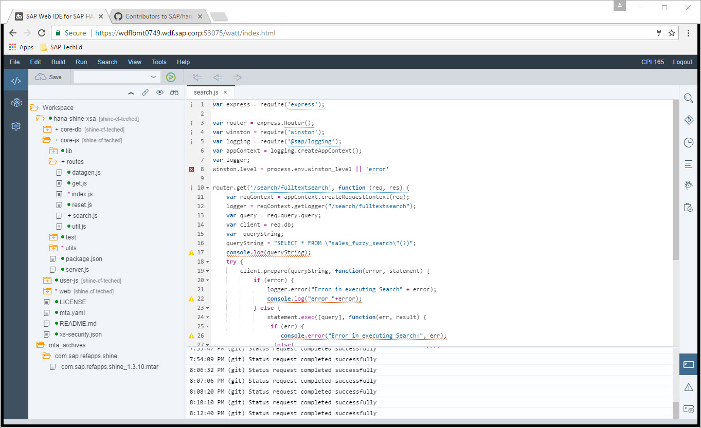
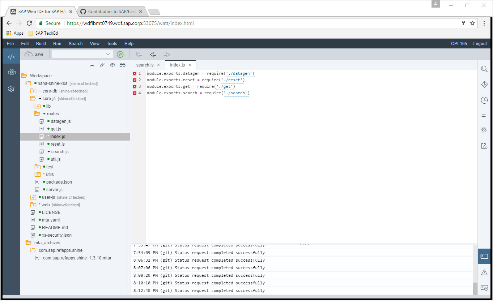
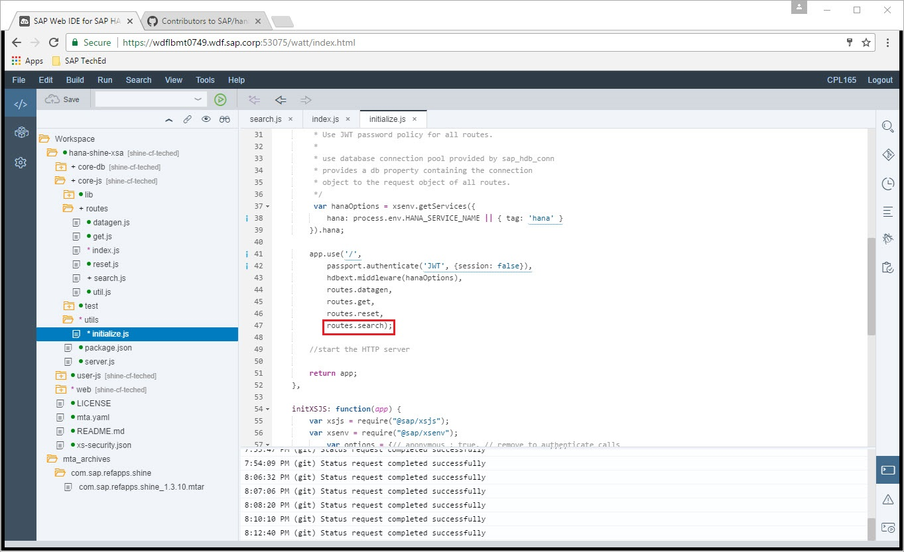

Exercise 05 : Expose REST API for Fuzzy Search
===============
## Estimated time

10 mins

## Objective
In this exercise you will expose the Fuzzy Search as REST API using node.js.

## Exercise Description
1. In Web IDE click on module core-js.  

2. Navigate to routes folder.
3. Right click on routes folder and click on New -> File.
4. In New File popup provide File Name as search.js.
5. Copy paste the below content into this search.js.

```js
var express = require('express');

var router = express.Router();
var winston = require('winston');
var logging = require('@sap/logging');
var appContext = logging.createAppContext();
var logger;
winston.level = process.env.winston_level || 'error'

router.get('/search/fulltextsearch', function (req, res) {
    var reqContext = appContext.createRequestContext(req);
    logger = reqContext.getLogger("/search/fulltextsearch");
    var query = req.query.query;
    var client = req.db;
    var  queryString;
	queryString = "SELECT * FROM \"sales_fuzzy_search\"(?)";
	console.log(queryString);
	try {
		client.prepare(queryString, function(error, statement) {
			if (error) {
				logger.error("Error in executing Search" + error);
				console.log("error "+error);
			} else {
				statement.exec([query], function(err, result) {
				 if (err) {
    			    console.error("Error in executing Search:", err);
    			  }else{
                	console.log("result array of search "+JSON.stringify(result));
                	res.writeHead(200, {'Content-Type' : 'application/json'});
                	res.end(JSON.stringify(result));
    			  }
				});
                
            }
    });
	}catch (e) {
		console.log("Error occuered during Search " + e.message);
	}
});

module.exports = router;

```
or copy code from file [search.js](./code/search.js).
 
> This code implements a route in Node.js and contains a call to fuzzy search Table Function.
6. Click on Save button.
7. Open file index.js.
8. In the last line add code as below
```js

module.exports.search = require('./search')

```
 
> The index.js is used to define all the routes.
9. Click on Save.    
10. Navigate to folder util.
11. Open file initialize.js.
12. Add code `, routes.search` at line number 46,  so that the code looks a below

```js
	app.use('/',
		    passport.authenticate('JWT', {session: false}),
		    hdbext.middleware(hanaOptions),
		    routes.datagen,
		    routes.get,
		    routes.reset,
		    routes.search);
```
 
> This is done to mount path of search REST API as middleware functions.
13. Click on Save.

## Summary
In this exercise you have created a REST API using node.js to expose the Fuzzy Search as a web service.
<br>
Continue with [Exercise6](../exercise06/README.md)
