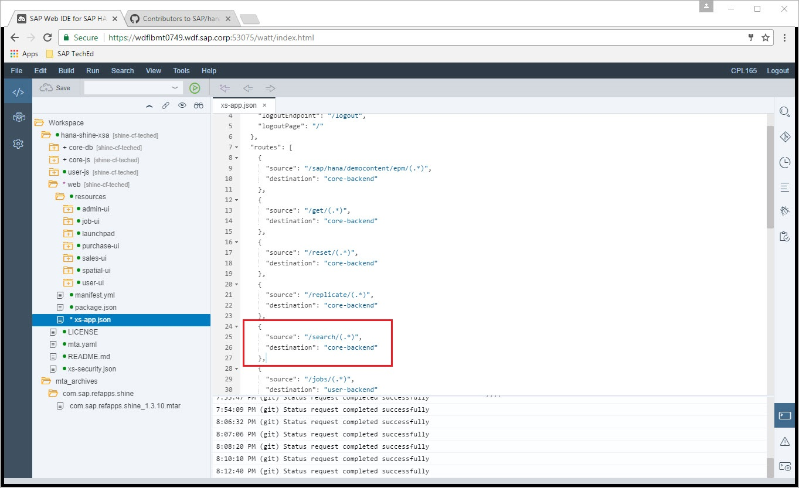
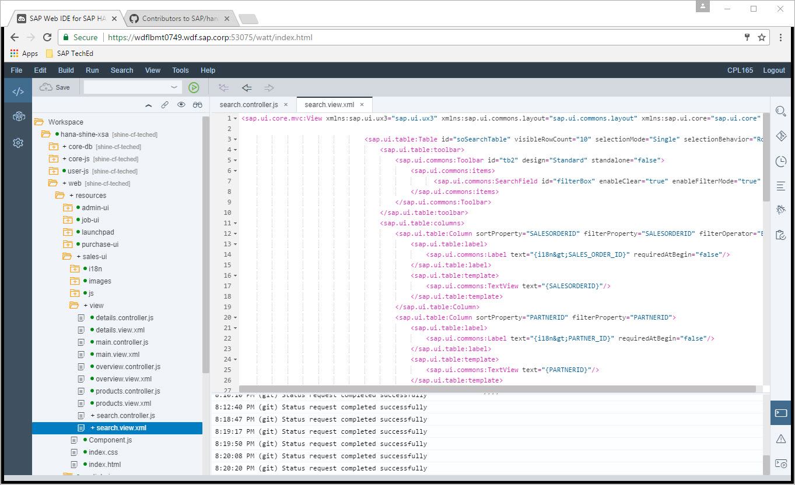
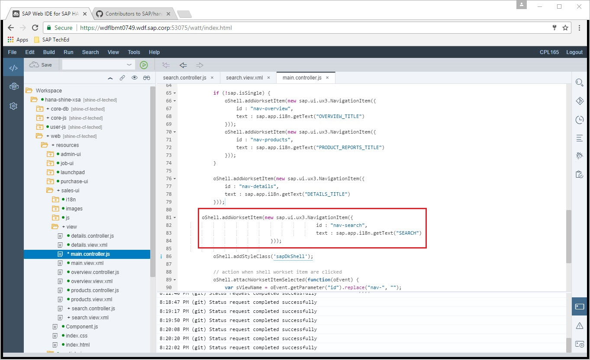

Exercise 06 : Develop User Interface
===============
## Estimated time

15 mins

## Objective
In this exercise you will develop a user interface to fire the search.

## Exercise Description
1. In Web IDE click on the web folder.  

2. Open the xs-app.json file.  
3. In line 24 insert the below code

```js
{
      "source": "/search/(.*)",
      "destination": "core-backend"
    },
```


> This file xs-app.json is used by Approuter to route the request to correct backend. Since we have added a new search service, this needs to be added to xs-app.json so that Approuter knows where to route the calls to search service implemented in exercise 5
4. Navigate to resources->sales-ui->view
5. Right click on view
6. Click New -> File
7. In New File pop up provide file name as search.controller.js. Copy below code to the file

```js
sap.ui.controller("sap.hana.democontent.epm.salesdashboard.view.search", {
	
	setFilter: function(oEvent){
		var keyWord = oEvent.getParameter("query");
		var soSearchTbl = this .byId("soSearchTable");
		var oPaginator=this.byId("tblPaginator");
			$.ajax({
				type: "GET",
				url: location.origin + "/search/fulltextsearch?query=" + keyWord,
				async: true,
				success: function(data, textStatus, request) {
					
					var jsonModel = new sap.ui.model.json.JSONModel();
					 jsonModel.setData({modelData: data});
					 
					  soSearchTbl.setModel(jsonModel);                                                                                  
			
			     soSearchTbl.bindRows("/modelData"); 
			    	var visibleRows = soSearchTbl.getVisibleRowCount(); 
			     
			     	oPaginator.setNumberOfPages(Math.ceil( data.length/parseInt(visibleRows)));
					oPaginator.setCurrentPage(1);
				},
				error: function(jqXHR, textStatus, errorThrown) {
					sap.ui.commons.MessageBox.show("Error in loading Jobs Table",
						"ERROR",
						"Error");
					return;
				}
			});
		
	},
	
	onPageChange: function(oEvent){
		var oTable = this.byId("soSearchTable");
		var visibleRows=oTable.getVisibleRowCount();
		var row = (parseInt(oEvent.getParameter("targetPage").toString())-1)*visibleRows;
		
		oTable.setFirstVisibleRow(row);
			
	}
	
});

```
or copy from file [search.controller.js](./code/search.controller.js)
> This file is the controller implementation in Javscript for Search Tab and contains definition all the events associated with this tab.
8. Save file.
9. Right click on view.
10. Click New -> File.
11. In New File pop up provide file name as search.view.xml. Copy below code to the file

```xml
<sap.ui.core.mvc:View xmlns:sap.ui.ux3="sap.ui.ux3" xmlns:sap.ui.commons.layout="sap.ui.commons.layout" xmlns:sap.ui.core="sap.ui.core" xmlns:sap.ui.table="sap.ui.table" xmlns:sap.ui.core.mvc="sap.ui.core.mvc" xmlns:sap.viz.ui5="sap.viz.ui5" xmlns:sap.viz.ui5.data="sap.viz.ui5.data" xmlns:data="http://schemas.sap.com/sapui5/extension/sap.ui.core.CustomData/1" xmlns:sap.viz.ui5.types="sap.viz.ui5.types" xmlns:sap.ui.commons="sap.ui.commons" controllerName="sap.hana.democontent.epm.salesdashboard.view.search">

                                <sap.ui.table:Table id="soSearchTable" visibleRowCount="10" selectionMode="Single" selectionBehavior="Row"  rowSelectionChange="onRowSelect"  title="Search Sales Orders">
                                    <sap.ui.table:toolbar>
                                        <sap.ui.commons:Toolbar id="tb2" design="Standard" standalone="false">
                                            <sap.ui.commons:items>
                                                  <sap.ui.commons:SearchField id="filterBox" enableClear="true" enableFilterMode="true" width="400px" search="setFilter"></sap.ui.commons:SearchField>
                                            </sap.ui.commons:items>
                                        </sap.ui.commons:Toolbar>
                                    </sap.ui.table:toolbar>
                                    <sap.ui.table:columns>
                                        <sap.ui.table:Column sortProperty="SALESORDERID" filterProperty="SALESORDERID" filterOperator="EQ">
                                            <sap.ui.table:label>
                                                <sap.ui.commons:Label text="{i18n&gt;SALES_ORDER_ID}" requiredAtBegin="false"/>
                                            </sap.ui.table:label>
                                            <sap.ui.table:template>
                                                <sap.ui.commons:TextView text="{SALESORDERID}"/>
                                            </sap.ui.table:template>
                                        </sap.ui.table:Column>
                                        <sap.ui.table:Column sortProperty="PARTNERID" filterProperty="PARTNERID">
                                            <sap.ui.table:label>
                                                <sap.ui.commons:Label text="{i18n&gt;PARTNER_ID}" requiredAtBegin="false"/>
                                            </sap.ui.table:label>
                                            <sap.ui.table:template>
                                                <sap.ui.commons:TextView text="{PARTNERID}"/>
                                            </sap.ui.table:template>
                                        </sap.ui.table:Column>
                                        <sap.ui.table:Column sortProperty="COMPANYNAME" filterProperty="COMPANYNAME">
                                            <sap.ui.table:label>
                                                <sap.ui.commons:Label text="{i18n&gt;COMPANY}" requiredAtBegin="false"/>
                                            </sap.ui.table:label>
                                            <sap.ui.table:template>
                                                <sap.ui.commons:TextView text="{COMPANYNAME}"/>
                                            </sap.ui.table:template>
                                        </sap.ui.table:Column>
                                        <sap.ui.table:Column sortProperty="CITY" filterProperty="CITY">
                                            <sap.ui.table:label>
                                                <sap.ui.commons:Label text="{i18n&gt;CITY}" requiredAtBegin="false"/>
                                            </sap.ui.table:label>
                                            <sap.ui.table:template>
                                                <sap.ui.commons:TextView text="{CITY}"/>
                                            </sap.ui.table:template>
                                        </sap.ui.table:Column>
                                        <sap.ui.table:Column hAlign="End" sortProperty="GROSSAMOUNT">
                                            <sap.ui.table:label>
                                                <sap.ui.commons:Label text="{i18n&gt;GROSS_AMOUNT}" requiredAtBegin="false"/>
                                            </sap.ui.table:label>
                                            <sap.ui.table:template>
                                                <sap.ui.commons:TextView text="{GROSSAMOUNT}" textAlign="End"/>
                                            </sap.ui.table:template>
                                        </sap.ui.table:Column>
                                        <sap.ui.table:Column hAlign="End" sortProperty="TAXAMOUNT">
                                            <sap.ui.table:label>
                                                <sap.ui.commons:Label text="{i18n&gt;TAX_AMOUNT}" requiredAtBegin="false"/>
                                            </sap.ui.table:label>
                                            <sap.ui.table:template>
                                                <sap.ui.commons:TextView text="{TAXAMOUNT}" textAlign="End"/>
                                            </sap.ui.table:template>
                                        </sap.ui.table:Column>
                                        <sap.ui.table:Column sortProperty="CURRENCY" filterProperty="CURRENCY">
                                            <sap.ui.table:label>
                                                <sap.ui.commons:Label text="{i18n&gt;CURRENCY}" requiredAtBegin="false"/>
                                            </sap.ui.table:label>
                                            <sap.ui.table:template>
                                                <sap.ui.commons:TextView text="{CURRENCY}"/>
                                            </sap.ui.table:template>
                                        </sap.ui.table:Column>
                                    </sap.ui.table:columns>
	                                     <sap.ui.table:footer>
					        <sap.ui.commons:Toolbar id="tb3" design="Standard" standalone="false" width="100%">
										        	
					            <sap.ui.commons:Paginator
					            	id="tblPaginator"  
					            	page="onPageChange" 
					            	class="centerAllign"/>
										            
					        </sap.ui.commons:Toolbar>
					    </sap.ui.table:footer>
                                </sap.ui.table:Table>
</sap.ui.core.mvc:View>

```
or copy code from file [search.view.xml](./code/search.view.xml)
> This file contains the xml view for the Search Tab 



12. Save file.
13. Open file main.controller.js.
14. Go to line 81 and insert below code
```js
oShell.addWorksetItem(new sap.ui.ux3.NavigationItem({
                                                id : "nav-search",
                                                text : sap.app.i18n.getText("SEARCH")
                                }));
```

> This code is to attach the Search Tab to the main view
15. Click on Save.

## Summary
In this exercise you have created a Search Tab in the Sales Dashboard tile of SHINE and embedded a search field which can be used for firing fuzzy search.
<br>
Continue with [Exercise7](../exercise07/README.md)
