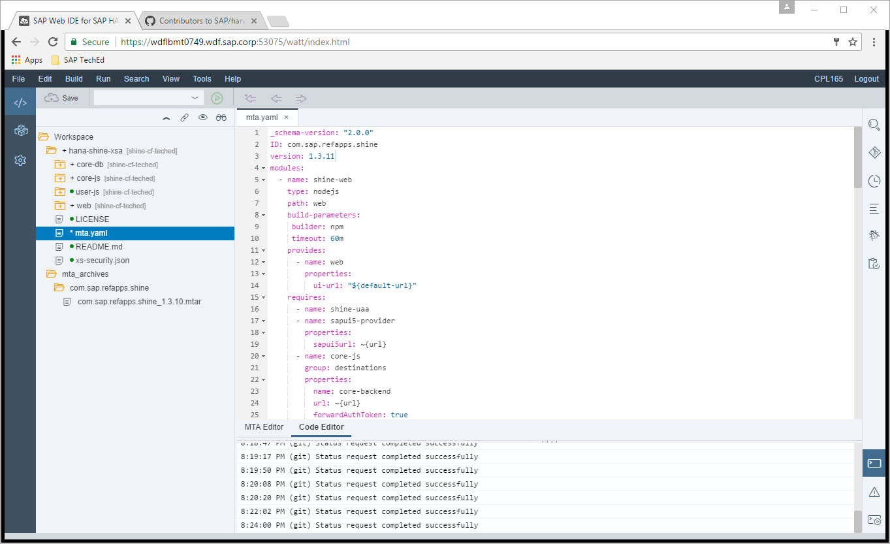
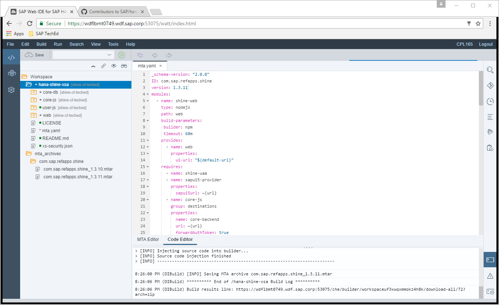
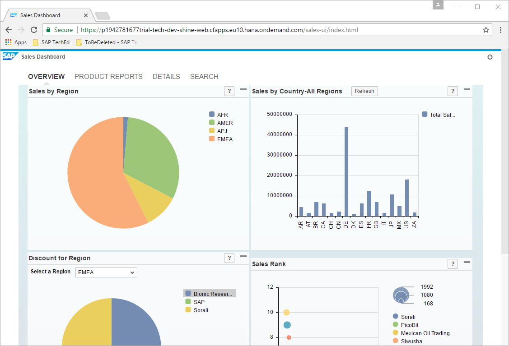
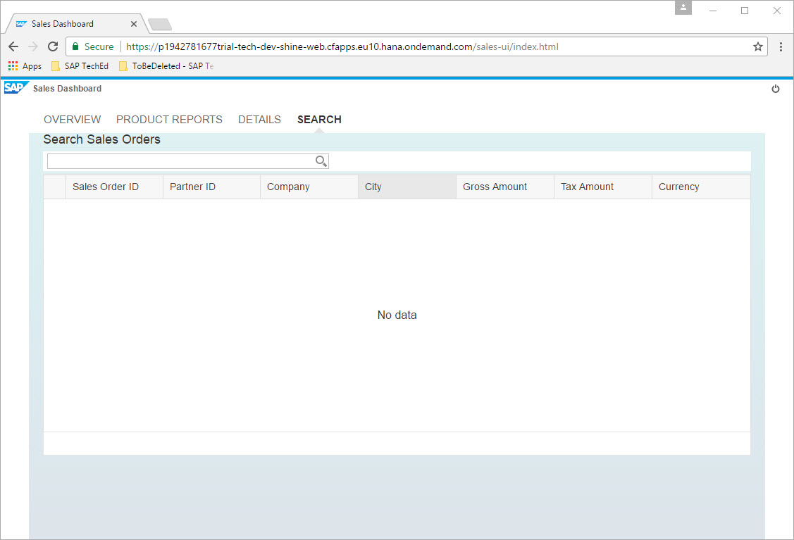
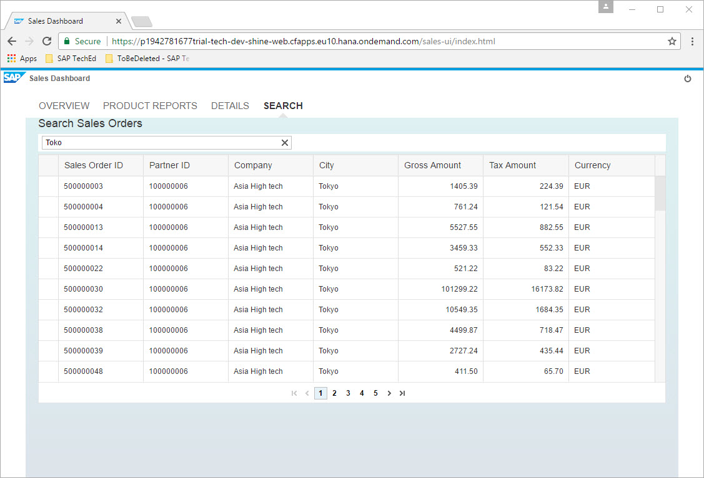

Exercise 07 : Build updated SHINE application and deploy it
===============

## Estimated time

20 mins

## Objective
In this exercise you will build the SHINE application after extending it and redeploy it

## Exercise Description

### 1. Build SHINE application
1. In Web IDE click on the hana-shine-xsa folder.
2. Open mta.yaml and change version from 1.3.10 to 1.3.11.  

3. Click on Save button.
4. Right click on the hana-shine-xsa folder and click on Build.
5. When the project is built an mtar is in the folder workspace->mta_archives->com.sap.refapps.shine->com.sap.refapps.shine_1.3.11.mtar.  

6. Right click on com.sap.refapps.shine_1.3.11.mtar and click on export and download it to your machines Desktop.

### 2. Deploy SHINE 
1. Open Command Line Interface.
2. Navigate to the folder where you have copied SHINE mtar, if its desktop, then `C:\Users\student\Desktop`.
3. Undeploy older version of SHINE, this can be done by running below command
` cf undeploy com.sap.refapps.shine -f --delete-services`
4. Wait for the undeploy to complete. You will notice one by one the modules being undeployed and finally the backing services being deleted. Remark: Undeployment is usually not necessary and included for showcasing. Delta deployment of a new version is also possible.
5. Run the command `cf deploy com.sap.refapps.shine_1.3.11.mtar` to deploy the updated version of SHINE application.
6. The deployment starts and within a few minutes the complete application gets deployed.
7. After deployment run the command `cf apps` to see all the deployed apps.
8. Run command `cf apps` to see all the backing service instances created.
9. Copy the url for the app shine-web and paste it in browser. Alternatively or additionally, you can now also go back to your SAP Cloud Platform cockpit, refresh and you will see your deployed applications there. Under the service `shine-web` you will see the same URL which you can also open directly from there. 

10. Login to this url with the SAP Cloud Platform User ID and Password.

### 3. Explore extended parts of application
1. Click on Ok to close the Welcome popup.
2. Click on the Sales Dashboard Tile.
3. A new tab called Search will be displayed.  

4. Click on Search tile.  

5. In Search filed enter any text like `Toko` or `Talp` and check the output.  

6. Fuzzy Search results will be displayed. 

## Summary
In this exercise you have deployed an extended version of SHINE mtar to Cloud Foundry Environment and explored it.
